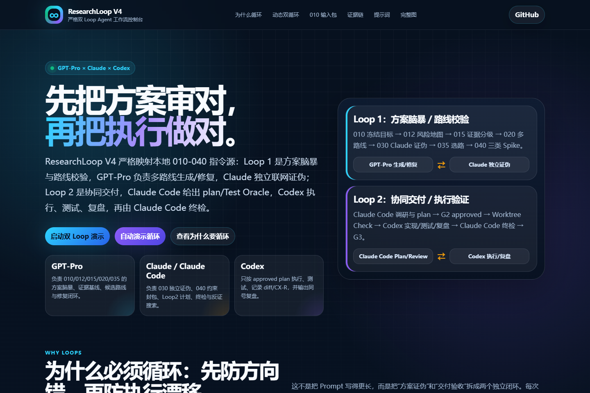

# ResearchLoop V4 · 双 Loop 多智能体协作工作流

[Live Demo](https://124-creator.github.io/ResearchLoop/) · [V4 Protocol](./docs/v4/000-dual-loop-controller-v4.md) · [Claude Code Contract](./docs/v4/010-claude-code-reviewer-v4.md) · [Codex Contract](./docs/v4/020-codex-executor-v4.md) · [MIT License](./LICENSE)

ResearchLoop V4 不是单个 Prompt，而是一套 **AI Agent 协作治理工作流**：

- **Loop 1：方案脑暴 / 路线校验层** — GPT-Pro 负责问题定义、风险地图、证据基线、候选路线与修复；Claude 独立联网证伪并给出 BLOCKER/RISK/PASS；最终形成 `010-040` 可交接 spec。
- **Loop 2：协同交付 / 执行验证层** — Claude Code 读取 `010-040`，产出调研台账、draft plan、Test Oracle 与 PLAN AUDIT；Codex 只按 approved plan 执行、测试、复盘；Claude Code 终检后才进入 G3 候选。

## Preview



## Live Demo

打开：<https://124-creator.github.io/ResearchLoop/>

这是静态公开 Demo：不上传文本，不调用外部 API，不包含私有数据。所有交互都在浏览器本地完成。

## 核心机制

### Loop 1 · 方案脑暴 / 路线校验层

```text
010 问题定义、冻结与需求确认（G1 第一道）
→ 012 难题风险地图
→ 015 GPT-Pro 外部调研基线 + 证据分级 A/B/C/D
→ 020 GPT-Pro 中性候选路线 R1/R2/R3
→ 030 Claude 独立联网证伪评审 + BLOCKER 校准表
→ 035 新鲜上下文路线裁决（G1 第二道）
→ 040 三类验证桩：A 可行性 / B 反证 / C 集成
```

Loop 1 解决的问题：**先判断怎么做才是对的**。每一步都有文档交接物，不靠聊天记忆传递。

### Loop 2 · 协同交付 / 执行验证层

```text
Claude Code 仓库探索 + 实现级联网调研 + skill 小测
→ INSTRUCTION LOAD CHECK
→ draft plan + Test Oracle + PLAN AUDIT
→ G2 人类 approved
→ WORKTREE CHECK
→ Codex 联网复核 + 隔离实现 + 测试
→ Codex 同号复盘
→ Claude Code 终检 + 联网反证搜索
→ G3 人类 verified
```

Loop 2 解决的问题：**把已经选对的路线真正做对**。Codex 不改范围、不换路线、不弱化测试；完成状态最多是 `implemented`，只有 G3 才是 `verified`。

## Demo 亮点

- 动态双 Loop 控制台：点击每个节点，联动展示动作、交接物、证据 ID、下一步和回环理由。
- 010-040 严格映射：不再简化成“方案—审查—修复”，而是完整展示风险地图、证据分级、多路线、BLOCKER 校准、路线裁决和三类 Spike。
- 同号交付链：展示 `research / plans / retrospectives / reviews` 如何通过 `NNN-模块中文名` 串起来，并用 `CC-R / CX-R / CC-V` 区分规划调研、执行证据与终检证据。
- 010 Packet Lab：把一句话任务转成 V4 第一层循环输入。
- GitHub Pages 友好：无构建、无外部脚本、单页静态可部署。

## Repository map

```text
ResearchLoop/
├── index.html                  GitHub Pages 入口
├── apps/                       Demo 源页面
├── assets/                     流程图和预览图
├── docs/v4/                    V4 协议源文件（与本地更新指令保持一致）
├── examples/                   示例工作流产物
├── templates/                  Plan 和复盘模板
├── AGENTS.md                   Codex 执行契约
├── CLAUDE.md                   Claude Code 审查契约
└── DESIGN.md                   Demo 设计源事实
```

## Privacy Boundary

公开仓库不应包含私有数据、凭据、个人联系方式、本地绝对路径或未公开项目材料。本 Demo 只展示工作流机制，不是后端执行服务。

## Status

- Current focus: V4 严格双 Loop 动态控制台。
- Deployment target: GitHub Pages。
- Verification style: local browser check, protocol keyword scan, mojibake scan, sensitive-info scan, screenshot preview。

## License

MIT License.
